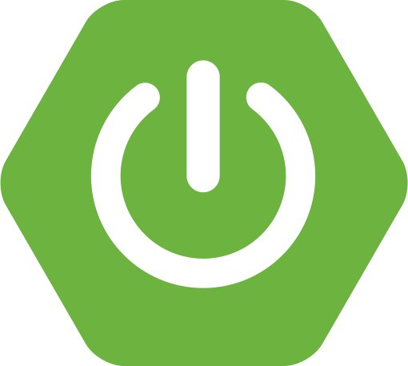
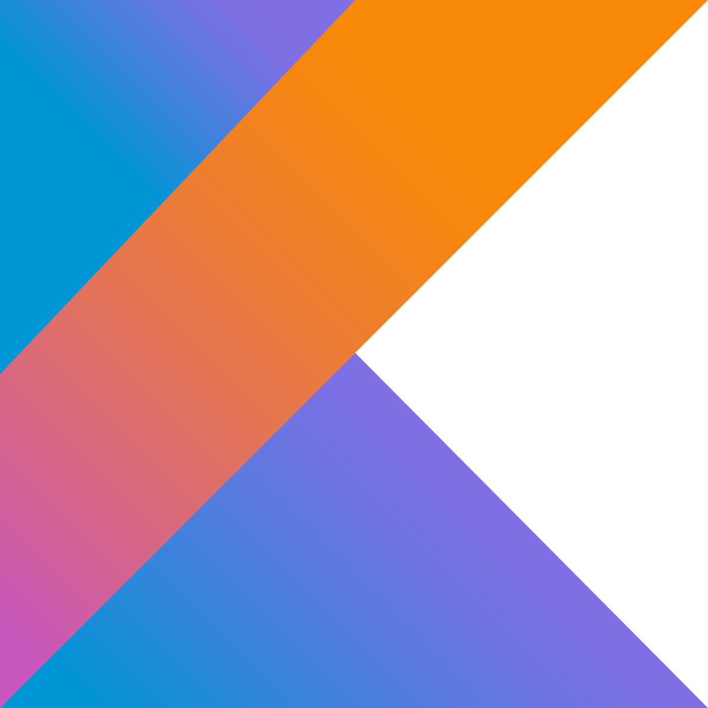
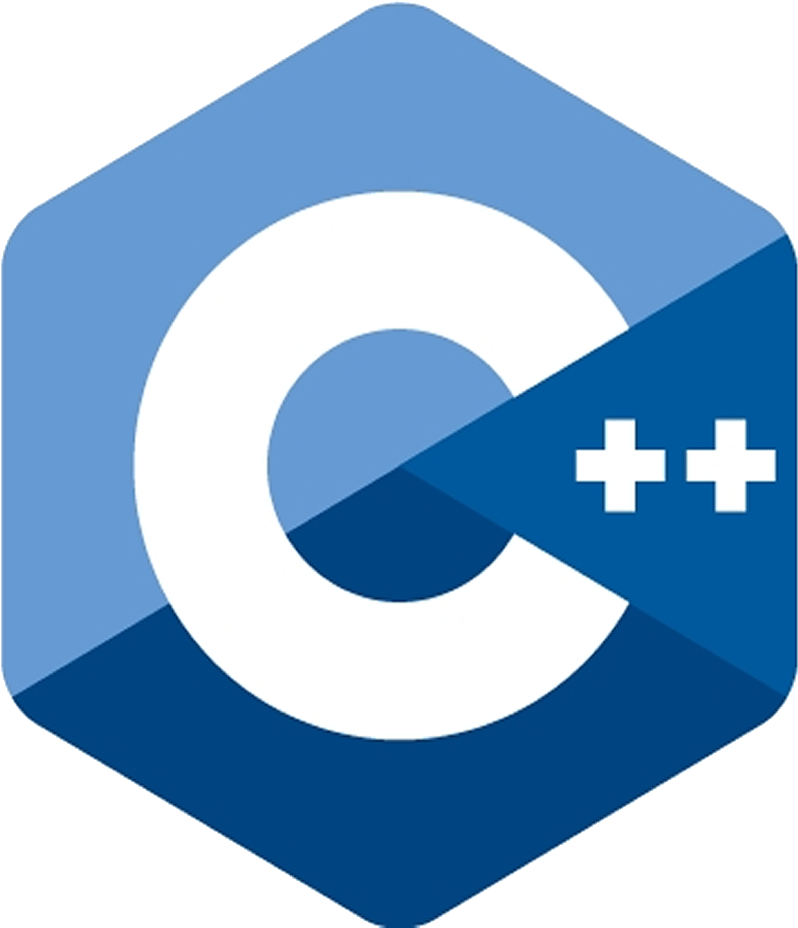

    <h1 align="center">
        Hi 
        
        I'm Shriram Ghadge 🇮🇳
    </h1>
    

        <h3 align="center">
            ✨ Computer Science Student 👨‍💻 2018-22 batch - IIT Dharwad 🎓
        </h3>
        <h4 align="center">
            🔭 currently working on Cloud ☁️ & Dev-Ops tools
        </h4>
        <h4 align="center">
            🌱 exploring Go, gRPC, Dockers, K8s, Jenkins & Tekton Pipelines
        </h4>
        <h4 align="center">
            🙃 I like to play & watch sports 🏏⚽🏸, spend time with friends 🙌, learn new things.
        </h4>
    

     
    

        
        
         
        
        
        
        
    

     
    

    

        <table border="0" >
            <tr>
                <td width="60%">
                     
                </td>
                <td>
                    <h3 align="center">
                        Languages and Tools
                    </h3>
                    

                         
                    

                    

                         
                         
                         
                    

                    

                         
                         
                         
                         
                    

                    

                         
                         
                         
                    

                    

                         
                         
                         
                         
                         
                    

                    

                        
                        
                        
                    

                    

                         
                         
                         
                         
                    

                    

                         
                         
                    

                </td>
            </tr>
        </table>
    

    

    

        <h2>
            Projects
        </h2>
        
        
         
        
        
         
        
        
         
        
        
         
        
        
    

    

    

        <h2>GitHub Stats</h2>
         
        
        
         
        
        
         
         
        
         
        
 Last updated at 11 March 2022

    

---

<!-- 
        0D1015  - dark background 
        2BA889  - Green
 -->
